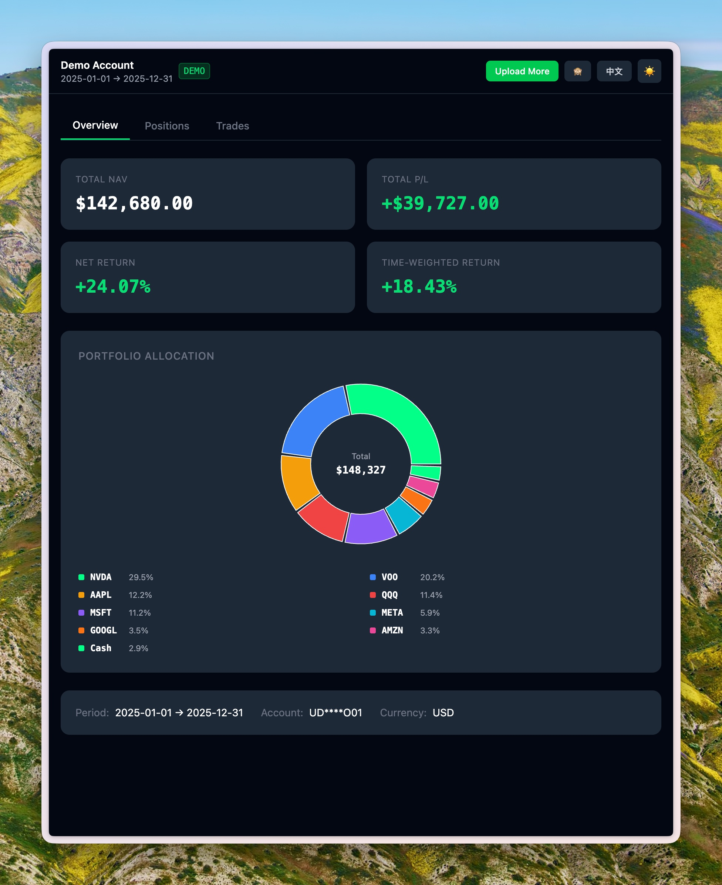
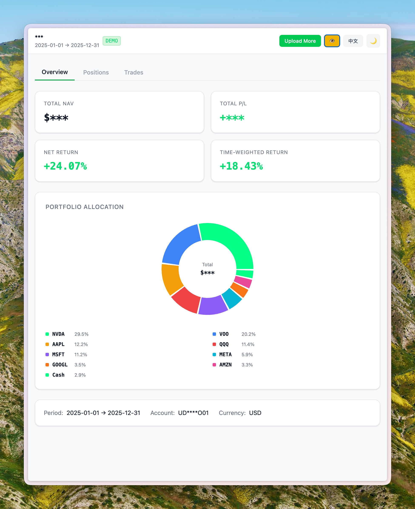
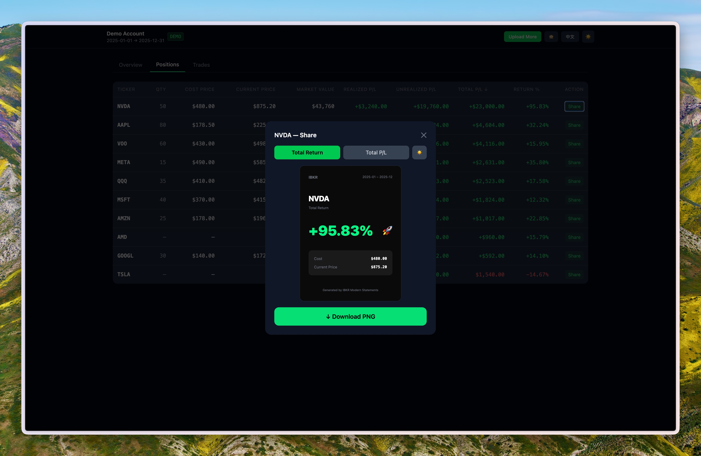
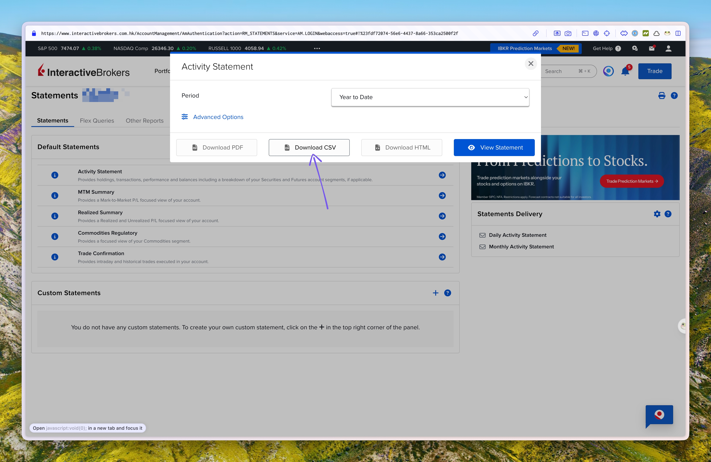

# IBKR Modern Statements


A client-side web app for analyzing Interactive Brokers activity statements. Upload your CSV exports and get a clean dashboard — no data ever leaves your browser.

**Live demo:** https://ibkr-stats.vercel.app/

---

## Screenshots

<table>
  <tr>
    <td></td>
    <td></td>
  </tr>
</table>



---

## Features

- **Demo mode** — click "Try Demo" on the upload page to explore with synthetic data, no CSV needed.
- **Multi-file support** — IBKR limits exports to 365 days per file. Upload multiple CSVs covering different periods; overlapping date ranges are detected and trades are deduplicated automatically.
- **Overview tab** — total NAV, realized + unrealized P/L, net return %, time-weighted return (TWR), and an interactive portfolio allocation donut chart with Cash included.
- **Positions tab** — sortable table with per-ticker cost price, current price, market value, realized/unrealized P/L, and return %. Share button on each row.
- **Trades tab** — full trade history, sortable by any column, filterable by ticker.
- **Share cards** — generate a 375×500px card per ticker in two variants (return rate or P/L amount) and two themes (dark / light). Downloads as a high-resolution PNG.
- **One-click privacy mask** — hide all dollar amounts instantly, safe for screen sharing or recording.
- **EN / 中文** language toggle.
- **Dark / light** theme toggle.

---

## Calculations

**TWR (Time-Weighted Return):** read directly from each CSV's `Net Asset Value` section. When multiple CSVs are uploaded, the per-period TWRs are chain-linked: `(1+r₁) × (1+r₂) × … − 1`. This matches the figure shown on the IBKR homepage.

**Net Return %:** `(endingNAV − startingNAV − deposits) / (startingNAV + deposits)`. Strips out cash flows so the number reflects investment performance, not capital added.

**Realized P/L:** summed directly from the merged trade records across all uploaded CSVs. This correctly handles positions where the buy and sell appear in different files.

---

## How to export from IBKR

1. Log in → **Reports** → **Statements**
2. Select statement type: **Activity**
3. Set date range (max 365 days per export) → format: **CSV** in English
4. For history longer than 365 days, export multiple CSVs and upload them together.



---

## Local development

```bash
npm install
npm run dev       # http://localhost:5173
npm test          # 24 unit tests
npm run build     # production build → dist/
```

Requires Node 18+.

---

## Deploy to Vercel

**Option A — CLI**

```bash
npm install -g vercel
vercel
```

Vercel auto-detects Vite: build command `npm run build`, output directory `dist`.

**Option B — GitHub auto-deploy**

1. Push to GitHub
2. [vercel.com](https://vercel.com) → Import Git Repository → select repo
3. Zero config needed — every `git push` triggers a new deployment

---

## Tech stack

| Layer | Choice |
|---|---|
| Framework | React 18 + TypeScript |
| Bundler | Vite |
| Styling | Tailwind CSS v4 |
| Components | Base UI (MUI headless) |
| Charts | Recharts |
| CSV parsing | PapaParse |
| Image export | html2canvas |
| Routing | React Router v6 (hash mode) |
| Tests | Vitest |

---

## Architecture

All processing happens in the browser. Data never leaves the device.

```
CSV file(s)
  → PapaParse
  → parseStatement()     src/lib/parser.ts        each file → StatementData
  → mergeStatements()    src/lib/merger.ts         dedup trades, compound TWR
  → StatementContext     src/context/             global state
  → Dashboard tabs
```

```
src/
  lib/
    parser.ts          Parses IBKR's multi-section CSV format
    merger.ts          Merges multiple StatementData, deduplicates trades
    calculations.ts    Per-ticker summaries and portfolio metrics
    demoData.ts        Synthetic data for demo mode
    shareCard.ts       html2canvas PNG export
  context/
    StatementContext.tsx
  pages/
    UploadPage.tsx
    DashboardPage.tsx
  components/
    overview/          SummaryCards, PortfolioPieChart, PeriodInfo
    positions/         PositionsTable, ShareModal, ShareCard
    trades/            TradesTable, TickerFilter
    ui/                PnlCell
  i18n.ts              EN/ZH string dictionary
```

---

## Privacy

- No network requests after initial page load
- CSV data is parsed in-browser and never transmitted
- Real IBKR statement files are gitignored (`example_ibkr_statements*.csv`) — use `tests/fixtures/` for anonymized test data
